# SHUROKKHA

**Smart IoT-Based Wearable Device for Real-Time Personal Safety**

SHUROKKHA is an ESP32-based wearable personal safety device that allows a user to trigger an emergency alert with a simple button press. On activation, the device retrieves the current GPS location and automatically sends an emergency email — including a Google Maps link to the user's location — to a pre-configured emergency contact. The system supports two alert modes: a **Silent SOS** for situations requiring discretion, and a **Loud SOS** with an audible buzzer.

---

## Overview

| | |
|---|---|
| Platform | ESP32 (ESP-WROOM-32) |
| Communication | Wi-Fi + Gmail SMTP (no GSM module required) |
| Location | NEO-6M GPS, with last-known-fix fallback |
| Interface | SSD1306 OLED status display, SOS push button, buzzer |
| Power | 18650 Li-ion battery with TP4056 charging and boost conversion |

---

## Features

- **Two SOS modes**, selected by number of button presses within a one-second window:
  - **2 presses** — Silent SOS. Sends the alert without sounding the buzzer.
  - **3 presses** — Loud SOS. Sounds the buzzer and sends the alert.
- **Real-time GPS tracking** via the NEO-6M module, with the last known location persisted to flash (`Preferences`) so a location is available even without a current fix.
- **Automated email alerts** over Wi-Fi using Gmail SMTP (`ESP_Mail_Client`), including a direct Google Maps link to the reported location.
- **OLED status display** showing system state: initializing, connecting, ready, sending, and the result of the last alert.
- **Non-blocking Wi-Fi reconnection**, retried in the background without interrupting normal operation.
- **Portable power design** — 18650 Li-ion cell with TP4056 charge protection and a boost converter for stable operating voltage.

---

## Hardware

| Component | Role |
|---|---|
| ESP32 DevKit (ESP-WROOM-32) | Main controller — runs firmware, Wi-Fi, GPS parsing, display, and buzzer logic |
| NEO-6M GPS Module | Provides real-time latitude and longitude |
| OLED Display (SSD1306, 1.3") | Displays system status |
| SOS Push Button | Emergency input trigger |
| Buzzer Module | Audible alert for Loud SOS mode |
| 18650 Li-ion Battery | Portable power source |
| TP4056 Charging Module | Battery charge management and protection |
| Boost Converter (LM2596-style) | Steps battery voltage up to the required operating voltage |
| Breadboard and Jumper Wires | Prototype circuit assembly |

**Components used in this project:**

<table align="center">
  <tr>
    <td align="center" width="25%">
      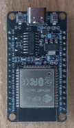<br/>
      <sub><strong>ESP32 DevKit</strong><br/>Main controller</sub>
    </td>
    <td align="center" width="25%">
      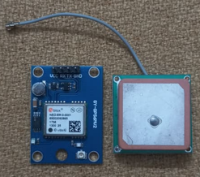<br/>
      <sub><strong>NEO-6M GPS Module</strong><br/>Location data</sub>
    </td>
    <td align="center" width="25%">
      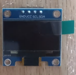<br/>
      <sub><strong>OLED Display</strong><br/>SSD1306, 1.3"</sub>
    </td>
    <td align="center" width="25%">
      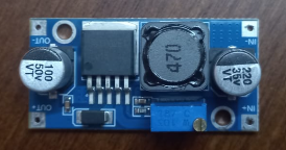<br/>
      <sub><strong>Boost Converter</strong><br/>Voltage step-up</sub>
    </td>
  </tr>
  <tr>
    <td align="center">
      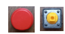<br/>
      <sub><strong>SOS Push Button</strong><br/>Emergency trigger</sub>
    </td>
    <td align="center">
      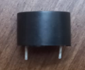<br/>
      <sub><strong>Buzzer Module</strong><br/>Audible alert</sub>
    </td>
    <td align="center">
      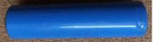<br/>
      <sub><strong>18650 Li-ion Battery</strong><br/>Power source</sub>
    </td>
    <td></td>
  </tr>
</table>

---

## Demonstration

<table align="center">
  <tr>
    <td align="center" width="33%">
      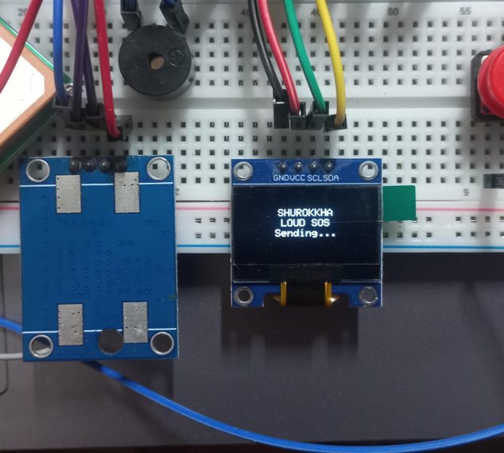<br/>
      <sub>Loud SOS in progress</sub>
    </td>
    <td align="center" width="33%">
      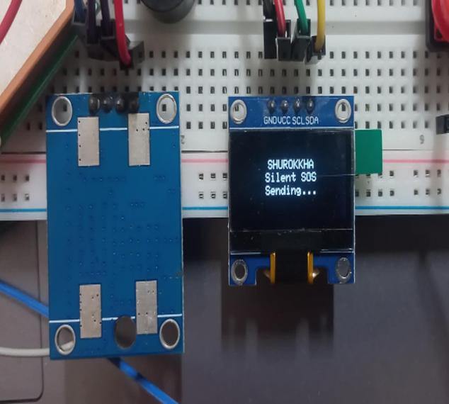<br/>
      <sub>Silent SOS in progress</sub>
    </td>
    <td align="center" width="33%">
      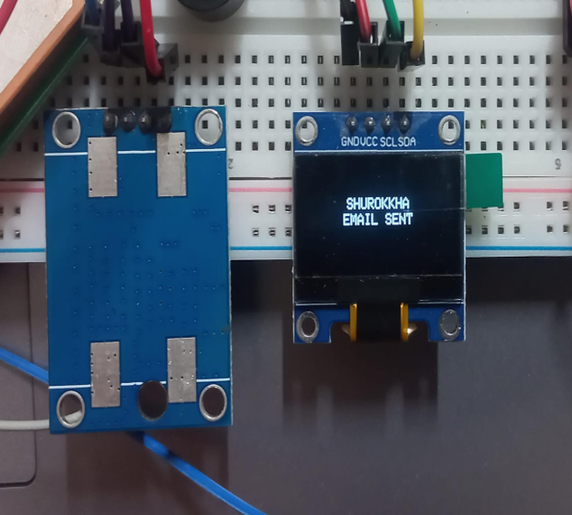<br/>
      <sub>Alert confirmed on OLED</sub>
    </td>
  </tr>
</table>

<table align="center">
  <tr>
    <td align="center" width="50%">
      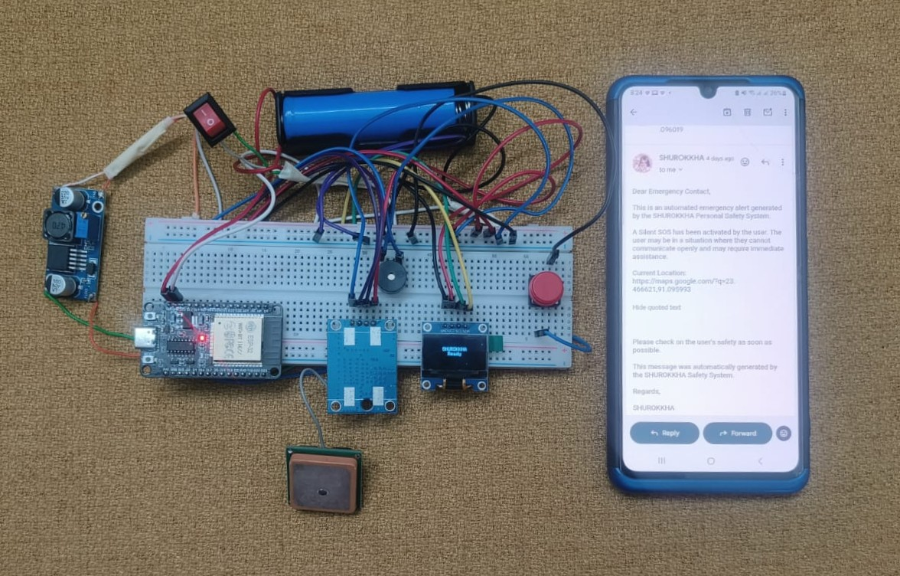<br/>
      <sub>Full hardware assembly with the emergency email received on a phone</sub>
    </td>
    <td align="center" width="50%">
      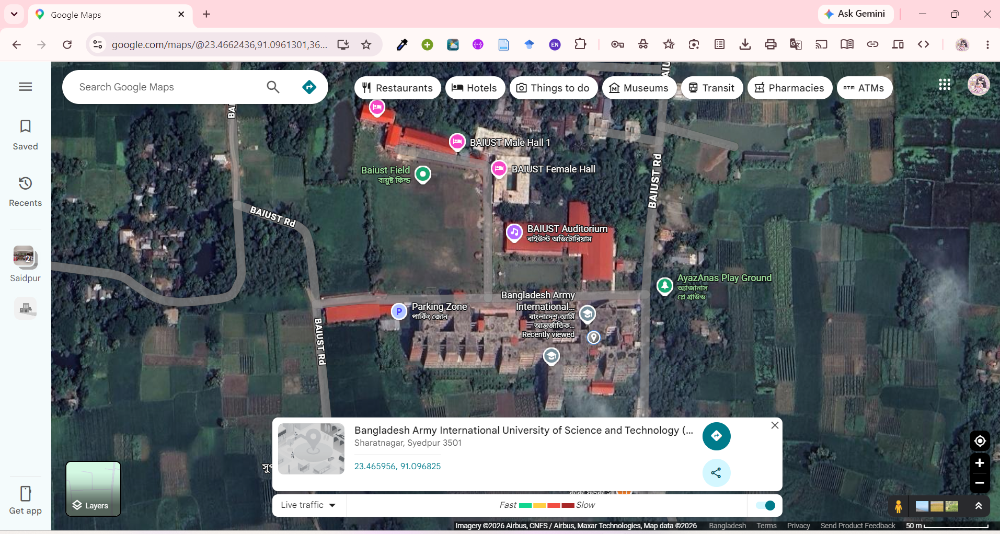<br/>
      <sub>Reported GPS location verified on Google Maps</sub>
    </td>
  </tr>
</table>

---

## Firmware Setup

This project is built on the Arduino framework for ESP32.

### 1. Install required libraries

Install the following via the Arduino Library Manager:

- `TinyGPSPlus`
- `Adafruit GFX Library`
- `Adafruit SSD1306`
- `ESP Mail Client` (mobizt)
- `Preferences` (bundled with the ESP32 board package)

### 2. Configure credentials

Credentials are kept out of version control. To set up your own:

```bash
cp firmware/config.h.example firmware/config.h
```

Edit `firmware/config.h` with your own Wi-Fi SSID and password, and Gmail credentials. Use a **Gmail App Password** rather than your account password — generate one at [myaccount.google.com/apppasswords](https://myaccount.google.com/apppasswords).

`firmware/config.h` is listed in `.gitignore` and will not be committed. Real credentials should never be committed to a public repository.

### 3. Wiring

| ESP32 Pin | Connects to |
|---|---|
| GPIO 16 (RX) | GPS TX |
| GPIO 17 (TX) | GPS RX |
| GPIO 21 | OLED SDA |
| GPIO 22 | OLED SCL |
| GPIO 4 | SOS push button (other leg to GND) |
| GPIO 5 | Buzzer (+) |

Full wiring diagram and pin table: [WIRING.md](WIRING.md)

### 4. Upload

Open `firmware/shurokkha.ino` in the Arduino IDE, select the appropriate ESP32 board, and upload.

---

## System Operation

1. On boot, the device connects to Wi-Fi and the OLED display shows **Ready**.
2. `readGPS()` continuously parses NMEA data from the GPS module. The last valid fix is cached in flash so a location remains available without a current fix.
3. `readButton()` debounces the SOS button and counts presses within a one-second window:
   - 2 presses — Silent SOS
   - 3 presses — Loud SOS
4. `sos()` updates the OLED display, optionally sounds the buzzer, and calls `sendEmailAlert()`, which connects to Gmail SMTP and sends a formatted alert email containing a Google Maps link to the current or last-known location.
5. `maintainWiFi()` retries the Wi-Fi connection in the background if the connection is lost.

---

## License

This project is released under the MIT License. See [LICENSE](LICENSE).
